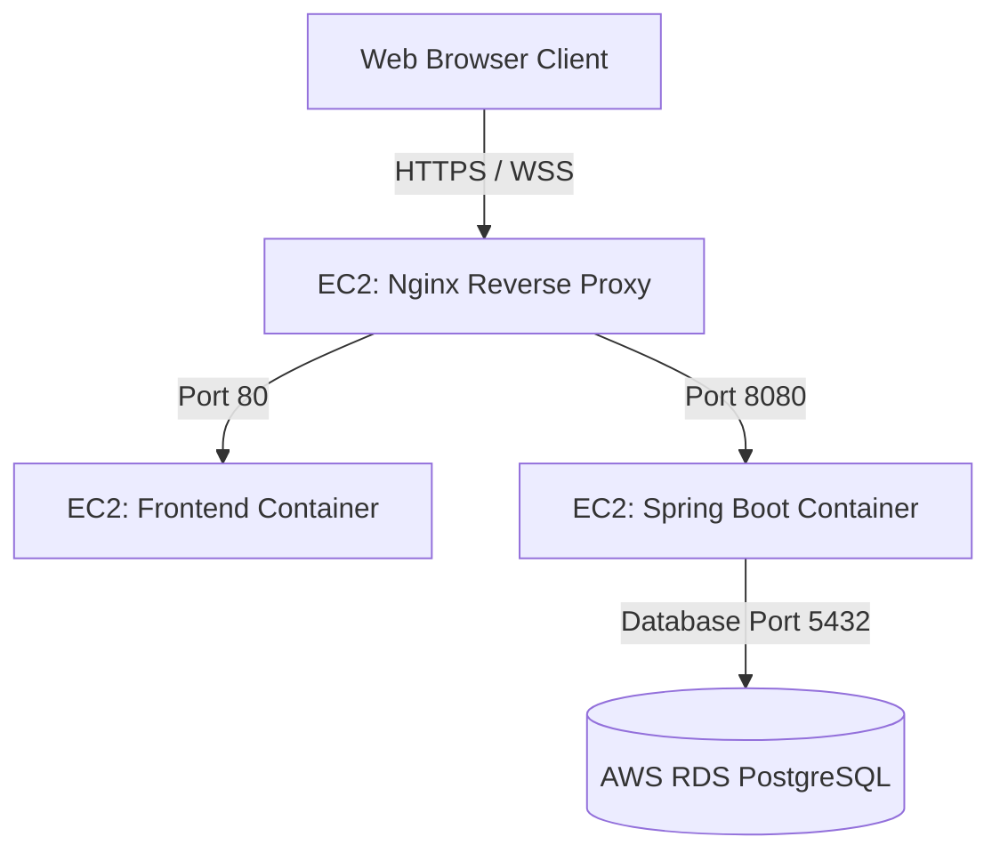

# AWS Deployment Guide: JourneyLink

This guide details the step-by-step process of deploying **JourneyLink** to AWS using **AWS EC2** (for running application containers) and **AWS RDS PostgreSQL** (for data persistence).

---

## Architecture Overview



---

## Step 1: Configure AWS RDS PostgreSQL

1. Log into your **AWS Management Console** and navigate to **RDS**.
2. Click **Create database** with these settings:
   - **Engine type**: PostgreSQL (Version 15.x recommended).
   - **Templates**: Free Tier / Dev-Test (depending on resource requirements).
   - **DB instance identifier**: `journeylink-db-prod`.
   - **Credentials**: Set a strong master username (e.g., `dbadmin`) and password.
   - **Connectivity**:
     - Do **not** make it publicly accessible (for security).
     - Associate it with a custom Security Group (e.g., `rds-sg`).
3. Click **Create Database** and note down the **Endpoint** and **Port (5432)** once it's created.
4. Update the security group `rds-sg` to allow inbound connections on port `5432` **only** from the Security Group of your EC2 instance (which we will create next).

---

## Step 2: Launch AWS EC2 Instance

1. Navigate to **EC2** in the AWS console and click **Launch instance**.
2. Configure settings:
   - **AMI**: Ubuntu 22.04 LTS (HVM) or Amazon Linux 2023.
   - **Instance type**: `t3.micro` or `t3.medium` (Free tier eligible `t2.micro` or `t3.micro` is sufficient for demo configurations).
   - **Key pair**: Create or import a SSH key pair (PEM format).
   - **Network settings (Security Group)**:
     - Allow SSH (`22`) from your IP.
     - Allow HTTP (`80`) from Anywhere.
     - Allow HTTPS (`443`) from Anywhere.
3. Click **Launch instance**.

---

## Step 3: Set Up Docker & Clone Project on EC2

1. Connect to your EC2 instance via SSH:
   ```bash
   ssh -i "your-key.pem" ubuntu@your-ec2-ip
   ```
2. Update the system and install Docker:
   ```bash
   sudo apt-get update && sudo apt-get upgrade -y
   sudo apt-get install -y docker.io docker-compose
   ```
3. Add the `ubuntu` user to the `docker` group so you don't need `sudo` for Docker:
   ```bash
   sudo usermod -aG docker ubuntu
   # Log out and log back in to apply group changes
   exit
   ssh -i "your-key.pem" ubuntu@your-ec2-ip
   ```
4. Clone your **JourneyLink** repository onto the EC2 instance.

---

## Step 4: Configure Production Environment Variables

1. In the project root of your EC2 instance, create a production environment file named `.env`:
   ```bash
   nano .env
   ```
2. Insert the following properties, replacing placeholders with your actual AWS RDS endpoint and credentials:
   ```env
   DB_HOST=your-rds-endpoint.amazonaws.com
   DB_PORT=5432
   DB_NAME=journeylink
   DB_USER=dbadmin
   DB_PASSWORD=your_rds_master_password
   # Update with a production secure JWT secret key (must be at least 512-bit)
   JWT_SECRET=production_long_cryptographically_secure_random_string_here
   ```

---

## Step 5: Modify docker-compose.yml for Production (Optional)

In production, you do not need the local `db` service container since you are utilizing AWS RDS.
We can launch the services using the production compose override file:
```bash
docker-compose -f docker-compose.prod.yml up --build -d
```
We have provided a template for `docker-compose.prod.yml` in the `aws/` directory.

---

## Step 6: Configure SSL and Domain (Nginx)

For WebSocket connections, secure WebSocket (`wss://`) is required if the frontend is served over HTTPS.
We recommend installing **Certbot** for automated SSL management:
```bash
sudo apt-get install certbot python3-certbot-nginx -y
sudo certbot --nginx -d yourdomain.com
```
This automatically updates Nginx configuration block to handle HTTPS and WebSocket proxy routing!
